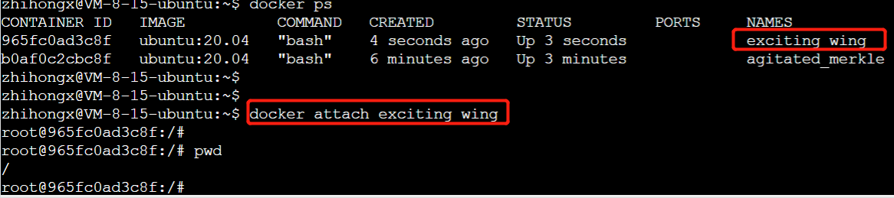
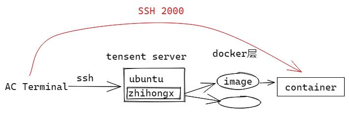

## 概述


如何保证第三层Docker层的环境一致？

镜像文件放在下面的文件夹中`/var/lib/acwing/docker/images`。

其中docker_lesson为docker教学统一用的镜像，可以用于生成一个docker运行环境。


配置完docker运行环境之后，可以将其理解为一个新的服务器环境，因为可以直接SSH连接，而不借助中间的云平台。


## docker用户组

为了避免每次使用docker命令都需要加上sudo权限，可以将当前用户加入安装中自动创建的docker用户组(可以参考[官方文档](https://docs.docker.com/engine/install/linux-postinstall/))：

```
sudo usermod -aG docker $USER
```

执行完此操作后，需要退出服务器，再重新登录回来，才可以省去sudo权限。

## docker教程


docker可以创建多个镜像，同一个镜像可以创建多个容器。

相同镜像创建的所有容器的初始环境一致，每个容器相当于一个完全独立的云端服务器。

### 镜像（images）

所有镜像有两部分构成：XXX:XXX（名称：版本号）

- docker pull ubuntu:20.04：拉取一个镜像（docker官方提供）

  

- docker images：列出本地所有镜像

- docker image rm ubuntu:20.04 或 docker rmi ubuntu:20.04：删除镜像ubuntu:20.04

- docker [container] commit CONTAINER IMAGE_NAME:TAG：创建某个container的镜像

  [container] 表示可选

- docker save -o ubuntu_20_04.tar ubuntu:20.04：将镜像ubuntu:20.04导出到本地文件ubuntu_20_04.tar中

  

  生成一个只有自己可读可写的tar压缩文件

  添加权限，使其可读

  

- docker load -i ubuntu_20_04.tar：将镜像ubuntu:20.04从本地文件ubuntu_20_04.tar中加载出来

  这其实就是展示的镜像迁移的过程，在迁移之前，先讲本地的镜像删除。

  当然，也可以迁移到其他服务器。仍然是将tar文件，scp传送，然后加载。

### 容器(container)

- docker [container] create -it ubuntu:20.04：利用镜像ubuntu:20.04创建一个容器。

  镜像相当于模板，可以理解为，利用模板创造出一个服务器

  

- docker ps -a：查看本地的所有容器

  - docker ps：查看本地所有正在运行的容器

- docker [container] start CONTAINER：启动容器

  - CONTAINER可以是container的ID或者NAMES

  - 

    状态显示已经启动了6s中

- docker [container] stop CONTAINER：停止容器

- docker [container] restart CONTAINER：重启容器

- docker [contaienr] run -itd ubuntu:20.04：创建并直接启动一个容器

  - 如果是-it，就是创建启动并进入；-itd是创建启动

  - 

    此时启动了两个容器

- docker [container] attach CONTAINER：进入容器

  - CONTAINER可以是container的ID或者NAMES

  - 

    可以看到，进入容器后所在的用户为root用户，并且当前在根目录下。

    ==当前进入的容器，完全当做是一个新的服务器（虚拟机）==

- 先按Ctrl-p，再按Ctrl-q可以挂起容器

  - 
  - 如果只是Ctrl-d，则会将容器关闭
  - 

- docker [container] exec CONTAINER COMMAND：在容器中执行命令

  - 容器必须是启动状态 exec表示执行

  

- docker [container] rm CONTAINER：删除容器

  - 容器必须关闭状态才能删除
  - rm是删除容器 rmi是删除镜像
  - 

- docker container prune：删除所有已停止的容器

  - container 不能省略

- docker export -o xxx.tar CONTAINER：将容器CONTAINER导出到本地文件xxx.tar中

  - 不仅镜像可以保存，容器也可以保存为tar文件
  - 

- docker import xxx.tar image_name:tag：将本地文件xxx.tar导入成镜像，并将镜像命名为image_name:tag

  - 注意，导入的是镜像，而不是容器。容器不能直接做迁移，但是容器的模板可以迁移
  - 先讲本地的ubuntu:20.04镜像下的容器全部删除，再讲ubuntu:20.04镜像删除
  - 将tmp.tar文件导入成镜像，命名为ubuntu:20.04
  - 

- docker export/import与docker save/load的区别：

  - export/import会丢弃历史记录和元数据信息，仅保存容器当时的快照状态
  - save/load会保存完整记录，体积更大

- docker top CONTAINER：查看某个容器内的所有进程

- docker stats：查看所有容器的统计信息，包括CPU、内存、存储、网络等信息

- docker cp xxx CONTAINER:xxx 或 docker cp CONTAINER:xxx xxx：在本地和容器间复制文件

  - 不管是文件夹还是文件 都可以直接复制 不用-r

- docker rename CONTAINER1 CONTAINER2：重命名容器

- docker update CONTAINER --memory 500MB：修改容器限制

## 实战演示

### 创建容器

进入AC Terminal，然后：

```python
scp /var/lib/acwing/docker/images/docker_lesson_1_0.tar server_name:  # 将镜像上传到自己租的云端服务器
ssh server_name  # 登录自己的云端服务器

docker load -i docker_lesson_1_0.tar  # 将镜像加载到本地
docker run -p 20000:22 --name my_docker_server -itd docker_lesson:1.0  # 创建并运行docker_lesson:1.0镜像

docker attach my_docker_server  # 进入创建的docker容器
passwd  # 设置root密码
```


使用docker_lesson:1.0镜像，来创建并运行容器。（相当于用使用印章刻了一个印）

```
docker run -p 20000:22 --name my_docker_server -itd docker_lesson:1.0 
```

* -p表示端口映射，将容器内的22端口映射到本地的20000端口（本地由于需要登录 22端口已被使用）
* --name 命名容器

进入创建的docker容器


为了后续可以通过ssh顺利登录，需要给root设置密码。

（对于云平台本身的密码，需要在网页端操作）

这里由于是创建的容器，使用passwd命令设置root密码。


注意，root用户不能修改密码，只能设置密码。因为权限最大，即使出错，也能重设。

现在用ctrl + p—ctrl + d挂起容器。

 使用ssh登录进服务器，也就是挂起的容器。

```
ssh root@localhost -p 20000
```


能否在其他地方登录呢？

### SSH到容器

由于刚刚设置成通过2000端口来登录容器，因此需要先去云平台控制台中修改安全组配置，放行端口20000。


此时退出到AC Terminal

```
ssh root@43.143.175.219 -p 20000
```


成功进入到容器

这就相当于我们创建了一个与腾讯云同等性能的云服务器（容器），并且可以直接从AC Terminal端登录到自己创建的云服务器（容器）。



（注意，容器必须处于挂起状态，如果关闭，则无法进入）

同样，在这个新的云服务中，也可以创建用户zhihongx。

```python
apt-get update
apt-get install sudo #安装sudo
sudo adduser zhihongx  # 创建用户zhihongx
sudo usermod -aG sudo zhihongx  # 给用户zhihongx分配sudo权限
```


当然，如果需要的话，可以在容器中继续按照docker创建服务器，无限套娃。

此时可以直接登录到容器中，自己所创建的用户下


### 设置别名

在AC Terminal下设置我们创建的Docker容器的免密登录

```
vim .ssh/config
```

为容器中用户添加别名

```
Host zhihongx_docker
	HostName 43.143.175.219
	User zhihongx
	Port 20000
```


### 免密登录

配置免密登录

```
ssh-copy-id zhihongx_docker
```


此时可以直接免密登录到自己在腾讯云服务器中创建的一个云服务器的用户下

```
ssh zhihongx_docker
```


### 安装tmux


配置tmux以及vim环境


此时，docker服务器配置完毕。