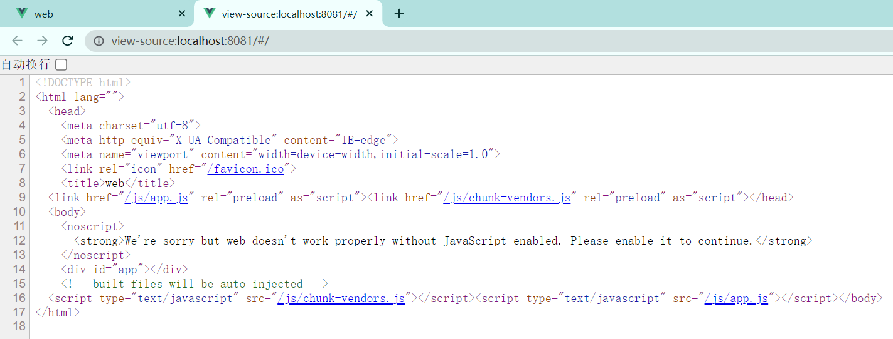

### 项目功能


### 配置git环境

1. 安装Git Bash（使用Mac和Linux的可以跳过这一步）：https://gitforwindows.org/

   > 全部默认即可

2. 输入`cd`回车进入家目录，执行命令`ssh-keygen`生成秘钥

   > 我们使用Gitee(Github、Acgit)的时候，通信的方式通过ssh
   >
   > 由于Gitee不支持用户名密码，因此需要借助秘钥来操作上

   

3. 然后进入`.ssh`文件夹，`id_rsa`和`id_rsa.pub`分别代表私钥和公钥文件，我们将公钥取出。

   

4. 将id_rsa.pub的内容复制到Gitee上

> 使用SSH公钥可以让你在你的电脑和 Gitee 通讯的时候使用安全连接（Git的Remote要使用SSH地址）

### 创建项目后端


> 注意，Thymeleaf是通过前后端不分离的方式写页面，由于我们的最终的项目是前后端分离，因此只是借助这个依赖演示一下前后端不分离的场景。最终是不使用这个依赖的。


Spring后端主要作用是负责实现一些函数，其中每一个url对应一个函数，负责给用户返回一些页面。

一般而言，我们建立一个名为controller的package，用于存储所有的后端函数，在controller中新建pk包。

#### 前后端不分离

在pk包中新建java文件，如果将其作为url对应的函数，需要添加`@Controller`注解

我们期待pk包中的所有文件所对应的url链接，都在pk目录下。


因此，添加注解`@RequestMapping("/pk/")`，也就是添加父目录的意思。

每一个url请求，都要返回一个HTML页面，我们将需要返回的页面在`backend/src/main/resources/templates`中创建。


注意每次修改之后，都需要重启项目。

以上就是前后端不分离的写法，后端向前端返回一个html页面。

#### 前后端分离

而对于前后端分离的写法，后端函数向前端返回的只是一些数据。

需要用到`@RestController`而不是`@Controller`

> `@RestController`用于返回数据
>
> `@Controller`是根据返回的`String`去寻找`template`中的`html`文件

可以返回字符串，可以返回List，也可以返回Map等等。


同样，还可以将Map嵌套到List中


#### 提交git


此时


同时IDEA中代码不再爆红


### 创建项目Web端

#### Vue安装

1、安装`Nodejs`

https://nodejs.org/en/

2、安装`@vue/cli`

```powershell
npm i -g @vue/cli
```

这里推荐使用早期版本

```powershell
npm i -g @vue/cli@4.5
```

3、启动`vue`自带的图形化项目管理界面

```powershell
vue ui
```

#### Vue项目管理

从而打开了vue的控制台


##### 创建Web

使用控制台创建项目，名为web。

注意将初始化git仓库取消


安装插件`vue-router`和`vuex`


安装依赖`jquery`和`bootstrap`


 


运行serve


此时，项目创建成功


同理，再创建一个项目acapp

##### 创建Acapp

添加vuex插件，成功后会在列表显示


此时就可以通过serve运行。

之后再将项目更新到git上

```bash
git status
git add .
git status
git commit - m "创建web端和acapp端"
git push
git status
```

### 前后端交互


在`src\router\index.js`文件中，去掉`createWebHashHistory`中的`Hash`

尝试在通过前端发送get请求获取后端数据


在前端中，通过F12观察请求的相应情况：


此为跨域问题，我们的web当前域名是localhost:8081，但是我们请求的地址的域名是localhost:3000，产生跨域问题，属于浏览器安全机制。

#### 跨域问题

在SpringBoot中解决跨域问题
添加配置类：CorsConfig

```JAVA
package com.kob.backend.config;

import org.springframework.context.annotation.Configuration;

import javax.servlet.*;
import javax.servlet.http.HttpServletRequest;
import javax.servlet.http.HttpServletResponse;
import java.io.IOException;

@Configuration
public class CorsConfig implements Filter {
    @Override
    public void doFilter(ServletRequest req, ServletResponse res, FilterChain chain) throws IOException, ServletException {
        HttpServletResponse response = (HttpServletResponse) res;
        HttpServletRequest request = (HttpServletRequest) req;

        String origin = request.getHeader("Origin");
        if(origin!=null) {
            response.setHeader("Access-Control-Allow-Origin", origin);
        }

        String headers = request.getHeader("Access-Control-Request-Headers");
        if(headers!=null) {
            response.setHeader("Access-Control-Allow-Headers", headers);
            response.setHeader("Access-Control-Expose-Headers", headers);
        }

        response.setHeader("Access-Control-Allow-Methods", "*");
        response.setHeader("Access-Control-Max-Age", "3600");
        response.setHeader("Access-Control-Allow-Credentials", "true");

        chain.doFilter(request, response);
    }

    @Override
    public void init(FilterConfig filterConfig) {

    }

    @Override
    public void destroy() {
    }
}
```

#### 前端

`setup:()`可以认为是整个组件的入口


#### 后端


#### 效果


#### 总结

在vue中实现的所有代码，都是在用户浏览器中执行，而不是在后端执行。也就是用户在打开网页的时候，会将vue代码全部先下载到浏览器，然后浏览器逐个执行每段代码。

可以查看网页源代码：



上述所实现的所有代码全部都集成在了app.js中


其中，执行到这段代码的时候：

```js
setup:() => {
    let bot_name = ref("");
    let bot_rating = ref("");
    $.ajax({
    url:"http://127.0.0.1:3000/pk/getbotinfo/",
    type:"get",
    success:resp=>{
      console.log(resp);
      bot_name.value = resp.name;
      bot_rating.value = resp.rating;
    }
    });
    return{
      bot_name,
      bot_rating
    };
```

交互逻辑是这样的：


用户浏览器拿到了结果：

```JS
success:resp=>{
      console.log(resp);
      bot_name.value = resp.name;
      bot_rating.value = resp.rating;
    }
    });
```

数据动态绑定到前端页面中


并且这种方式，更改后端所返回的JSON数据，前端页面也相应的发生改变。


最后记得每次改动完，都要记得保存代码到Git

```bash
git status
git add .
git status
git commit - m "创建web端和acapp端"
git push
git status
```

并且记得关闭Vue CLI的服务，否则8080端口将会被一直占用。